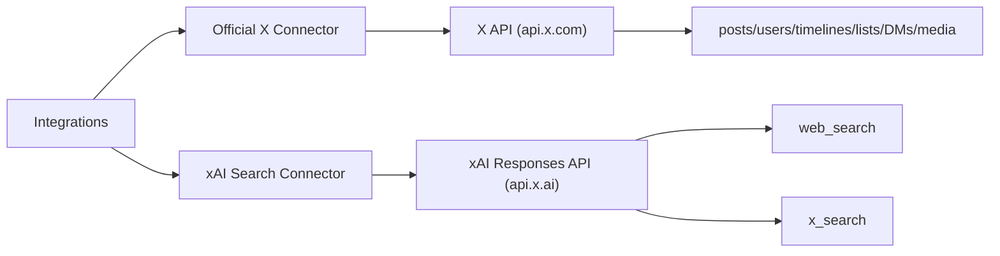

# X + xAI Search Auth RFC

Status: proposed
Scope: `x` and `xai-search` connectors only

## Decision

Keep two connectors.

- `x`: official X platform API
- `xai-search`: xAI search tools only

Do not merge them. They are different products with different auth, billing, and capability boundaries.

## Why

Because the boundary is real, not cosmetic.

| Connector | Purpose | Backend | Auth |
| --- | --- | --- | --- |
| `x` | direct X platform operations | `api.x.com` | bearer and user-context auth |
| `xai-search` | `web_search` and `x_search` only | `api.x.ai/v1/responses` | `XAI_API_KEY` |

The trap to avoid is pretending `x_search` is a substitute for the platform API. It is not.

- `x` gives raw entities and actions: posts, users, timelines, likes, follows, bookmarks, DMs, media, lists
- `xai-search` gives model-mediated search results and citations

## Connector Boundaries

## Auth Model

## `x` connector

Support three auth modes. Not one. Not "we'll see". Three.

| Mode | Name in config | Use for | Notes |
| --- | --- | --- | --- |
| App-only bearer | `bearer_token` | public read endpoints | simplest, cheapest to start with |
| OAuth 2.0 PKCE user tokens | `oauth2_*` | primary user-context auth | recommended for most modern user endpoints |
| OAuth 1.0a user tokens | `oauth1_*` | legacy / compatibility fallback | needed where docs still allow or legacy tooling depends on it |

### `x` auth precedence

Per request:

1. Use the auth mode explicitly required by the endpoint if only one is allowed.
2. For user-context endpoints that allow both OAuth 2.0 PKCE and OAuth 1.0a, prefer OAuth 2.0 PKCE.
3. For public read endpoints, prefer bearer unless the caller explicitly asks for user-context semantics.

That gives us sane defaults:

- public reads use bearer
- user actions use OAuth 2.0 PKCE first
- OAuth 1.0a exists as fallback, not the center of gravity

### `x` config fields

These should all live on the existing `x` connector instead of inventing a new paradigm.

#### Bearer

- `bearer_token`

#### OAuth 2.0 PKCE

- `oauth2_access_token`
- `oauth2_refresh_token`
- `oauth2_expires_at`
- `oauth2_scope`
- `oauth2_token_type`
- `client_id`

Optional:

- `client_secret`
- `redirect_uri`

#### OAuth 1.0a

- `oauth1_consumer_key`
- `oauth1_consumer_secret`
- `oauth1_access_token`
- `oauth1_access_token_secret`

### `x` setup policy

Phase the setup flow instead of trying to solve the whole universe on day one.

#### Phase 1

Manual token import.

- bearer token import
- OAuth 2.0 access/refresh token import
- OAuth 1.0a token import

This is fast to implement and unblocks endpoint work.

#### Phase 2

Built-in OAuth 2.0 PKCE browser flow.

- local callback server
- refresh token persistence
- scope-aware status output

#### Phase 3

Built-in OAuth 1.0a browser flow if we still need it.

Opinionated take: do not start with OAuth 1.0a flow automation unless forced by an endpoint gap. It is legacy glue, not where we should spend elegance points.

## `xai-search` connector

Auth is simple.

| Field | Purpose |
| --- | --- |
| `api_key` | xAI API key |
| `model` | default model used internally by Responses API |

That is it.

No bearer token. No OAuth. No user-context. No weird crossover.

Important implementation detail:

Even though product-wise this connector is "search only", xAI exposes `web_search` and `x_search` through the Responses API, so under the hood a model is still required in the request.

We should hide that complexity in the connector UX:

- one tool surface
- search-centric inputs
- model remains configurable but not central

Search-tool parity on this connector should include the xAI-specific `x_search` knobs we now expose in the tool schema:

- `allowed_x_handles`
- `excluded_x_handles`
- `from_date` / `to_date` aliases
- `enable_image_understanding`
- `enable_video_understanding`

## Endpoint Auth Matrix

This is the part that matters.

### `x` read endpoints

| Endpoint family | Preferred auth | Fallback | Notes |
| --- | --- | --- | --- |
| post lookup | bearer | OAuth 2.0 / OAuth 1.0a | public data works app-only |
| recent search | bearer | OAuth 2.0 / OAuth 1.0a | public data works app-only |
| user lookup | bearer | OAuth 2.0 / OAuth 1.0a | docs allow app-only for public lookups |
| public list lookup/timeline | bearer | OAuth 2.0 / OAuth 1.0a | keep simple |
| timelines with user context | OAuth 2.0 PKCE | OAuth 1.0a | home / mentions / personalized views |
| bookmarks lookup | OAuth 2.0 PKCE | OAuth 1.0a where allowed | user-private |
| likes lookup on public objects | bearer | OAuth 2.0 / OAuth 1.0a | depends on endpoint/data scope |
| DM lookup | OAuth 2.0 PKCE | OAuth 1.0a | app-only not supported |

### `x` write endpoints

| Endpoint family | Preferred auth | Fallback | Notes |
| --- | --- | --- | --- |
| create/delete post | OAuth 2.0 PKCE | OAuth 1.0a | user-context required |
| like/unlike | OAuth 2.0 PKCE | OAuth 1.0a | user-context required |
| repost/unrepost | OAuth 2.0 PKCE | OAuth 1.0a | user-context required |
| follow/unfollow | OAuth 2.0 PKCE | OAuth 1.0a | user-context required |
| bookmark create/delete | OAuth 2.0 PKCE | OAuth 1.0a where supported | user-context required |
| lists create/update/delete | OAuth 2.0 PKCE | OAuth 1.0a | user-context required |
| DMs send/delete | OAuth 2.0 PKCE | OAuth 1.0a | user-context required |
| media upload | OAuth 2.0 PKCE | OAuth 1.0a if needed later | pair with posts/DMs |

## Required OAuth 2.0 scopes

These should be modeled explicitly instead of buried in prose.

### Base read bundle

- `tweet.read`
- `users.read`
- `offline.access`

### Add when needed

- `tweet.write`
- `follows.read`
- `follows.write`
- `like.read`
- `like.write`
- `bookmark.read`
- `bookmark.write`
- `list.read`
- `list.write`
- `dm.read`
- `dm.write`
- `media.write`
- `mute.read`
- `mute.write`
- `block.read`
- `block.write`
- `space.read`

### Recommended scope sets by use case

#### Minimal posting app

- `tweet.read`
- `tweet.write`
- `users.read`
- `offline.access`

#### Social management app

- `tweet.read`
- `tweet.write`
- `users.read`
- `follows.read`
- `follows.write`
- `like.read`
- `like.write`
- `bookmark.read`
- `bookmark.write`
- `list.read`
- `list.write`
- `offline.access`

#### DM-capable app

- `tweet.read`
- `users.read`
- `dm.read`
- `dm.write`
- `media.write`
- `offline.access`

## Tool Surface Decisions

## `x`

The connector should stay human-friendly, but the internal coverage should become broad.

Two layers:

1. Curated tools for common operations
2. A raw operation layer for parity

### Curated `x` tools

Must exist:

- `get_post`
- `get_posts`
- `search_recent_posts`
- `search_all_posts`
- `get_user`
- `get_users`
- `get_user_posts`
- `get_mentions`
- `get_home_timeline`
- `create_post`
- `delete_post`
- `like_post`
- `unlike_post`
- `repost_post`
- `unrepost_post`
- `follow_user`
- `unfollow_user`
- `get_bookmarks`
- `add_bookmark`
- `remove_bookmark`
- `list_lists`
- `create_list`
- `update_list`
- `delete_list`
- `send_dm`
- `list_dm_conversations`
- `get_usage`

### Raw parity tools

Expose a controlled raw layer backed by endpoint metadata so we can reach parity without turning the curated surface into soup.

Suggested names:

- `x/raw_call`
- `x/raw_operation`

Input:

- `operation_id`
- `params`
- optional `auth_mode`

This is how we get breadth without writing bespoke wrappers for every obscure endpoint on day one.

## `xai-search`

Keep one tool: `search`.

Supported sources:

- `web`
- `x`

Required parity additions:

- `allowed_x_handles`
- `excluded_x_handles`
- `enable_image_understanding`
- `enable_video_understanding`
- `from_date`
- `to_date`
- web domain allow/block lists
- citation passthrough
- usage passthrough

Do not add generic chat/completions/model inference tools here. That would pollute the connector.

## Implementation Plan

### Phase 1

Get the auth substrate right.

- extend `x` auth schema for bearer + OAuth 2.0 + OAuth 1.0a token import
- add endpoint auth metadata
- add token selection logic
- add `auth_status` / `whoami` style diagnostics

### Phase 2

Expand `x` endpoint coverage.

- wire spec-backed operation registry internally
- implement curated wrappers for top-priority operations
- add raw operation fallback

### Phase 3

Finish `xai-search` parity.

- add missing xAI `x_search` parameters
- update default model naming/docs
- keep scope limited to `web_search` and `x_search`

### Phase 4

UX cleanup.

- setup flows
- docs
- auth testing commands
- pricing notes

## Non-Goals

- merging `x` and `xai-search`
- exposing generic Grok inference in `xai-search`
- scraper-style behavior in `x`
- forcing OAuth 1.0a everywhere like `xmcp` does

## Final Take

The clean design is:

- `x` becomes the real official X connector, with broad platform parity and sane auth fallback
- `xai-search` stays narrow and sharp: only `web_search` and `x_search`

That is cleaner than what we have now, and cleaner than `xmcp`.
