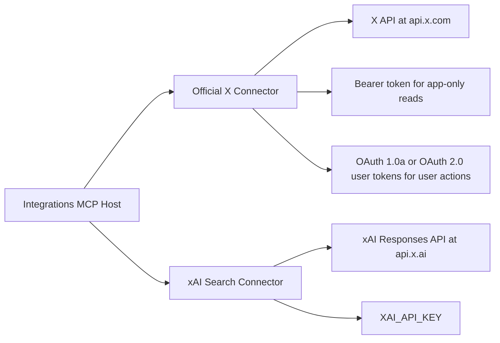

# X `xmcp` Gap Analysis

This is the blunt version.

`xmcp` is not doing anything magical. It is a thin OpenAPI-to-MCP bridge over X's official API surface. The reason it looks "complete" is that it exposes nearly the whole spec, while rzn-tools currently ships a curated `x` connector plus a separate `xai-search` connector and a scraper fallback `x-browser`.

## What `xmcp` Actually Is

- Repo: <https://github.com/xdevplatform/xmcp>
- OpenAPI source: `https://api.twitter.com/2/openapi.json`
- Runtime base URL: `https://api.x.com`
- Transport: FastMCP generated from OpenAPI
- Auth at request time: OAuth 1.0a signing on every request
- Grok/xAI usage: only in a separate demo client that calls the MCP server

Important: the README says `X_BEARER_TOKEN` is "required for this setup", but the actual request path in `server.py` signs requests with OAuth1 and does not use bearer auth for live MCP calls. There is a dead-looking helper for bearer headers. So the README is ahead of the code, or the code drifted. Either way: don't copy that confusion into rzn-tools.

## Current rzn-tools Shape

| Concern | rzn-tools today | `xmcp` |
| --- | --- | --- |
| Official X read APIs | Small curated `x` connector | Large OpenAPI surface |
| Official X write APIs | Mostly absent in `x` | Present via OpenAPI tools |
| X account auth | Bearer token only in `x` | OAuth1 per request |
| xAI / Grok auth | Separate `xai-search` with `XAI_API_KEY` | Separate test client with `XAI_API_KEY` |
| Rich thread scraping | `x-browser` | Not the point |
| Tool naming | Human-friendly curated names | Raw operationId names |

## The Auth Split

There are two auth systems. They should stay separate.



### 1. X / Twitter auth

Use this for official X endpoints.

- App-only public reads: bearer token
- User-context actions: OAuth 2.0 user token where supported
- OAuth 1.0a: still needed for parts of X's platform and is what `xmcp` uses for everything

### 2. xAI / Grok auth

Use this only for Grok / Responses API / `web_search` / `x_search`.

- Auth: `XAI_API_KEY`
- Billing: token usage plus server-side tool calls
- This is not a substitute for direct X API coverage

## Official Docs Reality Check

### X API billing

Official docs now describe X API v2 as pay-per-usage with credits purchased upfront and endpoint-specific costs tracked in the Developer Console.

- Docs: <https://docs.x.com/x-api/fundamentals/post-cap>
- Public doc confirms:
  - pay-per-usage
  - credit-based billing
  - per-endpoint pricing
  - usage tracked at the app level
- Public doc does **not** publish a nice fixed endpoint price sheet inline. Exact costs appear to live in the console.

### xAI tool pricing

Official docs say built-in tools are billed separately from tokens.

- Docs: <https://docs.x.ai/developers/models>
- Current public tool invocation prices:
  - `web_search`: $5 / 1k calls
  - `x_search`: $5 / 1k calls
  - `code_execution`: $5 / 1k calls
  - `attachment_search`: $10 / 1k calls
  - `collections_search`: $2.50 / 1k calls

That means the rzn-tools `xai-search` pricing entry is directionally right on request-cost for `x_search`/`web_search` at `$0.005` per call, but the default model string is stale versus current xAI docs.

## Gaps We Should Actually Close

### Gap 1: Auth model for official X is too narrow

Current `x` connector only supports bearer-token reads. That blocks:

- posting
- liking / unliking
- follow / unfollow
- bookmarks
- user-context timelines / mentions
- DMs
- most write actions

Opinionated take: this is the main gap. Endpoint count is secondary.

### Gap 2: Tool coverage is curated, not spec-backed

Current official `x` connector exposes a tiny slice:

- user lookup
- tweet lookup
- recent search
- recent conversation snapshot
- user tweets

`xmcp` exposes a much broader set, including:

- posts create/delete/like/repost
- follows
- bookmarks
- lists
- spaces
- communities
- news
- usage
- direct messages
- media upload
- trends

### Gap 3: `xai-search` is underpowered compared with current xAI tool options

Current `xai-search` supports:

- `sources = ["web", "x"]`
- date filters
- domain filters for web

Missing useful `x_search` parameters from current xAI docs:

- `allowed_x_handles`
- `excluded_x_handles`
- `enable_image_understanding`
- `enable_video_understanding`

### Gap 4: model defaults and docs are drifting

Current rzn-tools default model in `xai-search` is `grok-4-fast`.

Current xAI docs are centered on `grok-4.20-reasoning`, and the `xmcp` demo defaults mention `grok-4-1-fast` / `grok-4-1-fast-reasoning`. The naming drift is enough to justify updating defaults and making the model explicit in config/docs.

## One-to-One Mapping Strategy

Do not hand-code 100+ X endpoints one by one unless you enjoy maintenance pain.

Build a spec-backed connector layer for official X.

```text
Phase 1
  Keep current curated `x` tools for friendly UX
  Add new `x-official` connector generated from X OpenAPI
  Read-only allowlist first

Phase 2
  Add user-context auth profiles
  Enable write endpoints behind explicit allowlists

Phase 3
  Promote the stable subset into polished aliases in `x`
  Keep raw OpenAPI operations available for full coverage
```

## Recommended Architecture

### Connector split

- Keep `x` as the polished, human-friendly connector
- Keep `x-browser` as the non-official fallback/scraper
- Keep `xai-search` separate
- Add `x-official` as the broad OpenAPI-backed connector

That gives us this:

| Connector | Job |
| --- | --- |
| `x` | opinionated official X tools people actually use |
| `x-official` | raw/full official API coverage |
| `x-browser` | scraper fallback and richer thread reconstruction |
| `xai-search` | Grok-powered search over web/X |

### Auth profiles for `x-official`

Support explicit auth modes instead of pretending one token does it all.

| Mode | Use for | Credentials |
| --- | --- | --- |
| `bearer` | public read endpoints | `bearer_token` |
| `oauth1` | legacy/user-context/write endpoints | `consumer_key`, `consumer_secret`, `access_token`, `access_token_secret` |
| `oauth2_user` | user-context endpoints with scopes | `client_id`, `access_token`, optional `refresh_token`, scopes |

Rules:

- Read endpoints can use bearer when allowed
- Write endpoints must reject bearer
- Per-tool auth requirements should be encoded from the spec or an override map
- User should choose auth profile, not pray

## Concrete Mapping Priority

Don't chase the whole OpenAPI on day one. Ship the highest-value missing surface first.

### Tier 1

- `createPosts`
- `deletePosts`
- `likePost`
- `unlikePost`
- `repostPost`
- `unrepostPost`
- `followUser`
- `unfollowUser`
- `getUsersMe`
- `getUsersMentions`
- `getUsersTimeline`
- `getUsage`

### Tier 2

- bookmarks
- lists
- trends
- search all vs recent
- post analytics / insights where plan permits

### Tier 3

- media upload
- DMs
- spaces
- communities
- compliance / streaming-adjacent admin operations

## What I Would Change In rzn-tools First

1. Add `x-official` as a spec-backed connector with allowlist support.
2. Add first-class auth mode support: `bearer`, `oauth1`, `oauth2_user`.
3. Keep `x` as the nice wrapper, but let it delegate to `x-official` internally where possible.
4. Upgrade `xai-search` to current xAI tool params and current default model naming.
5. Update pricing/docs to reflect:
   - X API is credit-based pay-per-usage
   - xAI search tools are billed per 1k calls plus tokens

## Sharp Edges

- `xmcp` itself is early and slightly sloppy.
- Its README references OAuth2 token generation via `generate_authtoken.py`, but that file is not in the repo snapshot.
- It signs everything with OAuth1, which is simple but not the future-facing auth story X docs recommend for many user-context flows.
- Raw OpenAPI exposure is broad, but ugly. Good for completeness, mediocre for product UX.

## Final Take

The right move is not "copy `xmcp`."

The right move is:

- copy the **coverage model**
- avoid its **auth muddle**
- keep the cleaner rzn-tools UX
- add a raw `x-official` escape hatch for full endpoint parity

That gets us one-to-one compatibility where it matters without turning the existing `x` connector into a garbage drawer.
