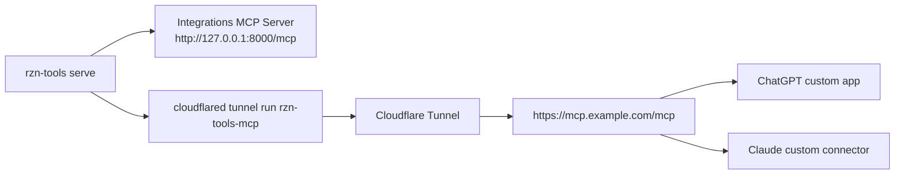

# RZN Integrations Remote MCP Setup with Cloudflare Tunnel

This is the practical setup guide for exposing the **RZN Integrations** MCP runtime
(`rzn-tools serve`) on the public Internet and then connecting it to remote MCP clients such as
ChatGPT and Claude.

This guide is opinionated on purpose:

- Use a **named Cloudflare Tunnel** for any real setup.
- Use a **subdomain you control** on a domain already hosted in Cloudflare.
- Treat `trycloudflare.com` quick tunnels as throwaway demo links, not infrastructure.
- Do **not** add a Worker unless you actually need one.

Once you have configured RZN Integrations with a hostname and tunnel name, the normal startup
command is just:

```bash
rzn-tools serve
```

That one command starts:

- the local rzn-tools MCP HTTP server
- the local `cloudflared` tunnel process

## Recommended Architecture



For the setup already present on this machine, the values are:

| Item | Value |
|---|---|
| Tunnel name | `rzn-tools-mcp` |
| Public hostname | `rzn-tools.sarav.xyz` |
| Local origin | `http://127.0.0.1:8000` |

## What You Actually Need

| Thing | Required? | Why |
|---|---|---|
| `rzn-tools` / `rzn-tools-mcp` | Yes | These are the RZN Integrations binaries you are exposing. |
| `cloudflared` | Yes | This is what creates the outbound tunnel from your machine to Cloudflare. |
| Cloudflare account | Yes | Needed for a stable named tunnel. |
| Domain on Cloudflare | Yes for stable/public setup | Required by Cloudflare to publish an application on your own hostname. |
| `wrangler` | No | Only needed if you also build or deploy a Worker. |
| Cloudflare Worker | No | Optional. Most people should point clients directly at the tunnel hostname. |

## Do You Need Your Own Domain?

Short answer:

- **For real use:** yes, put a domain or subdomain on Cloudflare.
- **For a quick demo:** no, you can use a temporary `*.trycloudflare.com` URL.

The catch is the important bit:

- Cloudflare says quick tunnels are for testing only, have a 200 concurrent request limit, and do **not** support SSE.
- They are random and temporary.
- That makes them a bad default for remote MCP clients.

Blunt version: if you care whether the thing still works tomorrow, use your own hostname.

So the sane choice is:

```text
mcp.example.com
```

Not:

```text
https://random-words.trycloudflare.com
```

Also, do not confuse these hostnames:

| Hostname | What it is |
|---|---|
| `mcp.example.com` | The hostname users and MCP clients should use. |
| `<UUID>.cfargotunnel.com` | The internal tunnel target Cloudflare creates behind the scenes. |
| `random.trycloudflare.com` | Temporary quick tunnel URL for testing only. |

## Fast Path

If you already have a domain on Cloudflare and just want the shortest route:

```bash
brew install cloudflared
cloudflared tunnel login
cloudflared tunnel create rzn-tools-mcp
cloudflared tunnel route dns rzn-tools-mcp mcp.example.com
```

Create `~/.cloudflared/config.yml`:

```yaml
tunnel: <TUNNEL_UUID>
credentials-file: /Users/you/.cloudflared/<TUNNEL_UUID>.json

ingress:
  - hostname: mcp.example.com
    service: http://localhost:8000
  - service: http_status:404
```

Then:

```bash
rzn-tools configure cloudflare tunnel --hostname mcp.example.com --tunnel-name rzn-tools-mcp
rzn-tools serve
```

That is the whole happy path.

Your remote MCP URL is:

```text
https://mcp.example.com/mcp
```

## Full Setup, End to End

### 1. Put your domain on Cloudflare

If your domain is not already on Cloudflare:

1. Add the site in the Cloudflare dashboard.
2. Update your registrar nameservers to the Cloudflare nameservers Cloudflare gives you.
3. Wait for the zone to become active.

If your domain is already on Cloudflare, skip this and just pick a subdomain such as `mcp.example.com`.

### 2. Install `cloudflared`

On macOS:

```bash
brew install cloudflared
```

Verify:

```bash
cloudflared --version
```

### 3. Authenticate `cloudflared`

This is the locally-managed tunnel path, which matches the existing `cloudflared tunnel run <name>` workflow:

```bash
cloudflared tunnel login
```

That login flow creates a `cert.pem` in your local Cloudflare config directory.

Typical files after setup:

| Path | Purpose |
|---|---|
| `~/.cloudflared/cert.pem` | Lets you create/manage locally-managed tunnels for the account. |
| `~/.cloudflared/<TUNNEL_UUID>.json` | Tunnel-specific credentials file. |
| `~/.cloudflared/config.yml` | Local tunnel routing config. |

### 4. Create the tunnel

```bash
cloudflared tunnel create rzn-tools-mcp
cloudflared tunnel list
```

Write down the tunnel UUID.

### 5. Create the DNS route

Pick a hostname, for example:

```text
mcp.example.com
```

Then:

```bash
cloudflared tunnel route dns rzn-tools-mcp mcp.example.com
```

That creates the DNS record, but it still will not work until the tunnel is running.

With rzn-tools configured correctly, `rzn-tools serve` handles starting the local tunnel process for you.

### 6. Create `~/.cloudflared/config.yml`

Example:

```yaml
tunnel: 12345678-1234-1234-1234-123456789abc
credentials-file: /Users/you/.cloudflared/12345678-1234-1234-1234-123456789abc.json

ingress:
  - hostname: mcp.example.com
    service: http://localhost:8000
  - service: http_status:404
```

If you only expose rzn-tools, this is enough.

### 7. Configure rzn-tools

Tell rzn-tools which public hostname and tunnel name it should expect:

```bash
rzn-tools configure cloudflare tunnel --hostname mcp.example.com --tunnel-name rzn-tools-mcp
```

This stores the local rzn-tools serving defaults in its config directory.

The hostname you save here must exactly match the hostname in `~/.cloudflared/config.yml`.
If `serve.json` says `rzn-tools.sarav.xyz` but `config.yml` still routes `mcp-old.example.com`,
Cloudflare is going to hand you garbage and call it a network problem.

Optional sanity check:

```bash
rzn-tools configure cloudflare doctor
```

Typical rzn-tools config path:

- macOS: `~/Library/Application Support/rzn-tools/serve.json`
- Linux: usually `~/.config/rzn-tools/serve.json`

### 8. Start everything

```bash
rzn-tools serve
```

If a tunnel name is configured, `rzn-tools serve` starts both:

- the local rzn-tools MCP HTTP server
- `cloudflared tunnel run <name>`

So you do not need a second terminal in the normal case.
The remote HTTP catalog is curated for agents:

- canonical task tools are listed
- compatibility aliases like `youtube_transcripts/*` and legacy Hacker News names stay callable but are hidden
- `auth/*` setup helpers are hidden from the remote catalog

If you change the hostname, restart any already-running `rzn-tools serve` process. The running
server does not hot-reload `allowed_hosts`, so an old process can keep rejecting the new public
hostname with `421 Host not allowed`.

If you want localhost only, use:

```bash
rzn-tools serve --local-only
```

You should now have:

```text
https://mcp.example.com/mcp
```

Health checks:

```text
https://mcp.example.com/healthz
https://mcp.example.com/readyz
```

## Should You Use a Worker?

Usually, no.

Use a Worker only if you need one of these:

- custom request filtering
- header rewriting
- custom auth in front of the MCP server
- analytics or policy enforcement
- a single public API surface that fans out to multiple origins

If all you want is "make my local rzn-tools MCP server reachable from ChatGPT/Claude", the tunnel hostname is enough.

## ChatGPT Setup

OpenAI renamed "connectors" to "apps", so expect the UI to say **Apps**.

### What matters

- ChatGPT custom MCP integrations are **remote only**. You cannot point ChatGPT at a local-only server.
- OpenAI's developer mode supports **SSE and streaming HTTP** remote MCP servers.
- If ChatGPT says your server does not implement its specification, your remote MCP surface is not compatible enough yet.

### Add rzn-tools in ChatGPT

1. Open ChatGPT on the web.
2. Go to `Settings -> Apps -> Advanced settings -> Developer mode`.
3. Enable Developer mode.
4. In Apps settings, create an app for your remote MCP server.
5. Enter:

```text
https://mcp.example.com/mcp
```

6. Save it.
7. In a chat, switch to Developer mode and enable your app.

### Important ChatGPT caveats

- OpenAI's help docs say remote servers only.
- OpenAI's help/docs also make clear that plan availability and tool permissions vary by plan.
- If you do not see Developer mode or app creation UI, your plan, region, or workspace settings probably do not allow it.

### ChatGPT operator advice

Use a stable hostname for ChatGPT. Do not use quick tunnels here unless you enjoy debugging ghosts.

## Claude Setup

Anthropic supports remote MCP connectors in Claude and Claude Desktop.

### What matters

- Remote MCP requests come from **Anthropic's cloud**, not from the user's local machine.
- Claude supports **SSE and Streamable HTTP** remote servers.
- Claude Desktop should add remote connectors via the product UI, not by stuffing remote URLs into `claude_desktop_config.json`.

### Add rzn-tools in Claude / Claude Desktop

For individual plans:

1. Open Claude or Claude Desktop.
2. Go to `Customize -> Connectors`.
3. Click `+`.
4. Choose `Add custom connector`.
5. Enter:

```text
https://mcp.example.com/mcp
```

6. Save it.
7. Enable the connector in a conversation from the `+` / Connectors UI.

For Team / Enterprise:

1. Owner or Primary Owner adds the connector in organization settings.
2. Users then connect and enable it individually.

### Claude operator advice

Because Anthropic brokers remote connector calls from its own cloud, the tunnel hostname must be reachable from the public Internet. "Works on my laptop" is irrelevant here.

## Current RZN Integrations-Specific Notes

The current RZN Integrations HTTP surface is:

- `/mcp`
- `/healthz`
- `/readyz`

The current RZN Integrations remote-serving flow is:

```bash
rzn-tools configure cloudflare tunnel --hostname mcp.example.com --tunnel-name rzn-tools-mcp
rzn-tools serve
```

`rzn-tools configure cloudflare doctor` is optional troubleshooting, not part of the normal happy path.

If you want exact parity with the setup already used on this machine, use:

```bash
rzn-tools configure cloudflare tunnel --hostname rzn-tools.sarav.xyz --tunnel-name rzn-tools-mcp
```

## Troubleshooting

### `cloudflared` is missing

Install it. Nothing else matters until this is fixed.

### `rzn-tools configure cloudflare doctor` says config is missing

Run:

```bash
rzn-tools configure cloudflare tunnel --hostname mcp.example.com --tunnel-name rzn-tools-mcp
```

### DNS exists but the site is dead

Possible causes:

- `rzn-tools serve` is not running
- an old `rzn-tools serve` process is still running with stale `allowed_hosts`
- `rzn-tools serve` failed to auto-start `cloudflared`
- `~/.cloudflared/config.yml` still routes a different hostname
- `~/.cloudflared/config.yml` points to the wrong local port
- the hostname points to a tunnel that is down

Check all three moving parts:

| Layer | Must match | Typical failure |
|---|---|---|
| `serve.json` | `hostname = mcp.example.com` | rzn-tools prints the right public URL but the rest of the stack disagrees |
| `~/.cloudflared/config.yml` | `ingress.hostname = mcp.example.com` | tunnel is up, but the wrong hostname is actually routed |
| running origin on `127.0.0.1:8000` | accepts `Host: mcp.example.com` | stale process returns `421 Host not allowed` |

### You get a Cloudflare `1016`

Your DNS record exists, but the tunnel target is not healthy or not currently running.

### ChatGPT says the MCP server does not implement its spec

That is not a DNS problem. That means the remote MCP HTTP behavior is not compatible enough for ChatGPT's current expectations.

### Claude cannot connect

Check:

- the URL is public HTTPS
- the tunnel is up
- the hostname resolves correctly
- your firewall is not blocking public access

## Security Notes

This guide uses the simplest path: a public HTTPS endpoint with no extra auth layer in front.

That is acceptable for private testing. It is not the setup I would bless for a serious shared deployment.

If you expose a write-capable MCP server to the Internet:

- keep the tool surface tight
- prefer read-only tools when testing clients
- do not expose personal or destructive tools casually
- add proper auth before sharing it widely

## Source Links

Cloudflare:

- [Cloudflare Tunnel overview](https://developers.cloudflare.com/tunnel/)
- [Cloudflare Tunnel setup](https://developers.cloudflare.com/tunnel/setup/)
- [Create a locally-managed tunnel](https://developers.cloudflare.com/tunnel/advanced/local-management/create-local-tunnel/)
- [Tunnel routing / DNS records](https://developers.cloudflare.com/tunnel/routing/)
- [Cloudflared downloads](https://developers.cloudflare.com/tunnel/downloads/)

OpenAI:

- [ChatGPT Developer mode](https://platform.openai.com/docs/developer-mode)
- [Building MCP servers for ChatGPT and API integrations](https://platform.openai.com/docs/mcp/)
- [Apps in ChatGPT](https://help.openai.com/en/articles/11487775-connectors-in-chatgpt)
- [Developer mode and MCP apps in ChatGPT](https://help.openai.com/en/articles/12584461-developer-mode-apps-and-full-mcp-connectors-in-chatgpt-beta)

Anthropic:

- [Get started with custom connectors using remote MCP](https://support.claude.com/en/articles/11175166-get-started-with-custom-connectors-using-remote-mcp)
- [Build custom connectors via remote MCP servers](https://support.claude.com/en/articles/11503834-build-custom-connectors-via-remote-mcp-servers)
- [Use connectors to extend Claude's capabilities](https://support.claude.com/en/articles/11176164-pre-built-integrations-using-remote-mcp)
