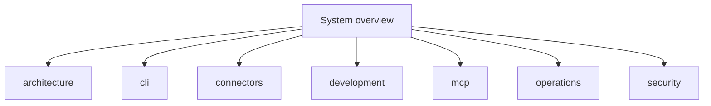

# System overview

This project is a Rust program that gives one interface to many data sources.
It has three main parts.

| Part | Path | Job |
| --- | --- | --- |
| Core library | `rzn_tools_core/` | Defines connectors, auth, routing, output, and MCP logic. |
| CLI | `rzn_tools_cli/` | Provides the `rzn-tools` command. |
| MCP server | `rzn_tools_mcp/` | Serves the same tools over MCP stdio or HTTP. |

The normal data path is:

```text
user or agent
  -> CLI or MCP
  -> connector registry
  -> connector tool
  -> provider API or local source
  -> structured result
```

Cargo features decide which connectors are compiled. The default CLI build
contains a small useful set. The `full` profile adds the portable server set.
Desktop-only and browser features stay opt-in.

Start here:

- [Architecture](architecture.md) explains the code layout.
- [CLI](cli.md) explains common commands.
- [Connectors](connectors.md) lists the source adapters.
- [MCP](mcp.md) explains stdio and HTTP use.
- [Development](development.md) gives build and test commands.
- [Operations](operations.md) gives install and run steps.
- [Security](security.md) gives credential and privacy rules.

<!-- tusker:docs-map:begin -->

<!-- tusker:docs-map:end -->
