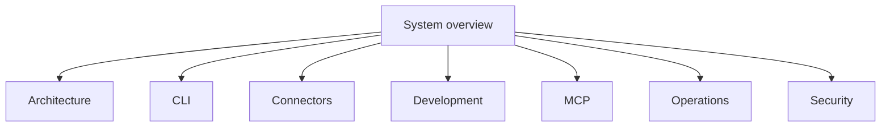

# System overview

This project gives one interface to many data sources.

It is a Rust workspace named `rzn-tools`.

| Part | Path | Purpose |
| --- | --- | --- |
| Core | [`rzn_tools_core/`](../../rzn_tools_core/) | Defines connectors, routing, auth, output, usage, and shared MCP behavior. |
| CLI | [`rzn_tools_cli/`](../../rzn_tools_cli/) | Provides the `rzn-tools` command. |
| MCP | [`rzn_tools_mcp/`](../../rzn_tools_mcp/) | Provides MCP over standard input and HTTP. |

The normal request path is:

```text
caller -> CLI or MCP -> connector registry -> connector tool -> source -> result
```

Cargo features select the connectors in a binary. A connector is unavailable when its feature is off.

This directory is the complete product guide:

- [Architecture](architecture.md)
- [CLI](cli.md)
- [Connectors](connectors.md)
- [MCP](mcp.md)
- [Development](development.md)
- [Operations](operations.md)
- [Security](security.md)

The source code is the final authority. Use CLI help or MCP `tools/list` for the live schema.

<!-- tusker:docs-map:begin -->

<!-- tusker:docs-map:end -->
